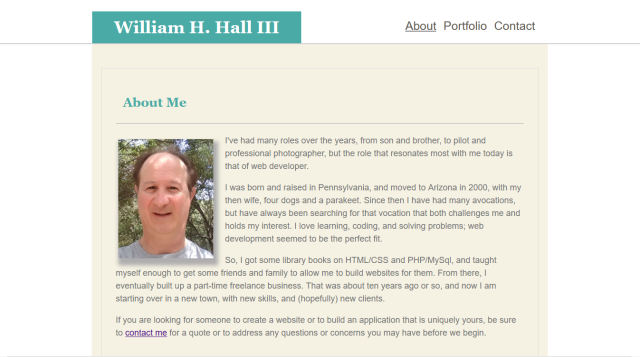

# Basic-Portfolio

This is a basic portfolio website created with HTML and CSS. It is not mobile friendly, as it has no @media queries. 

## Screenshot

## Usage

This was my first attempt at creating a portfolio as part of the Univeristy of Arizona Coding Bootcamp, and I was very heppy with the result. Not the most sophisticated design, but clean and effective. It is best viewed on laptops or tablets.

